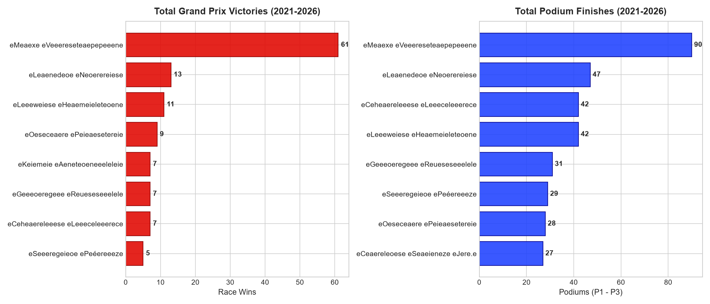
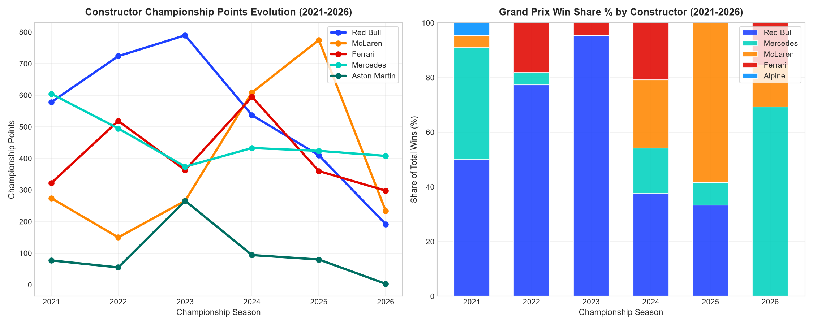
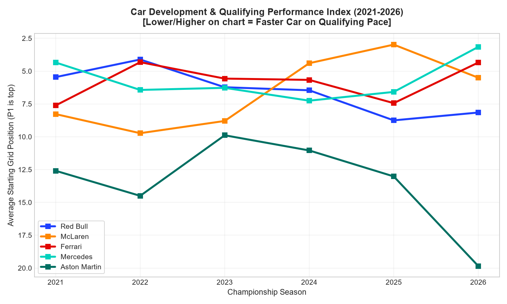
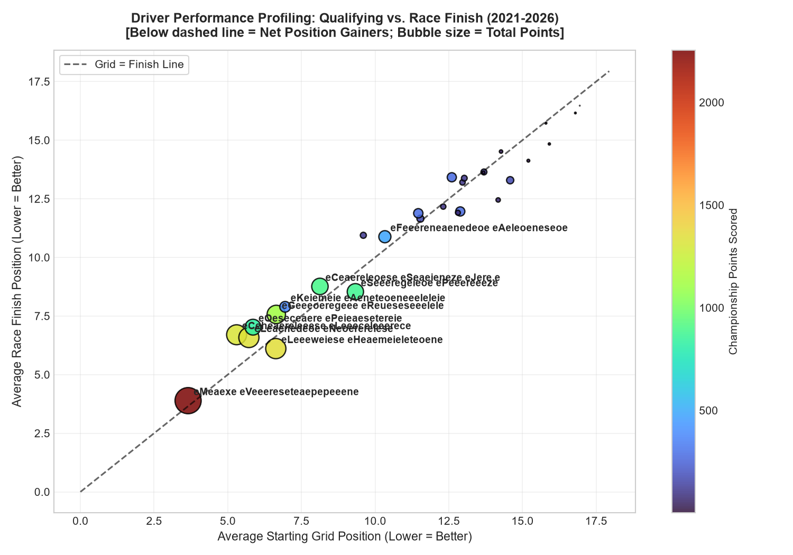
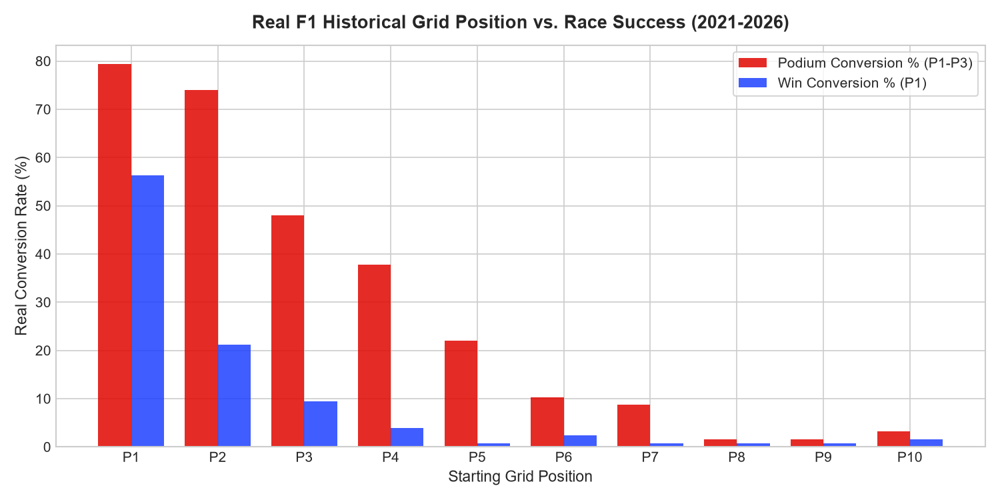
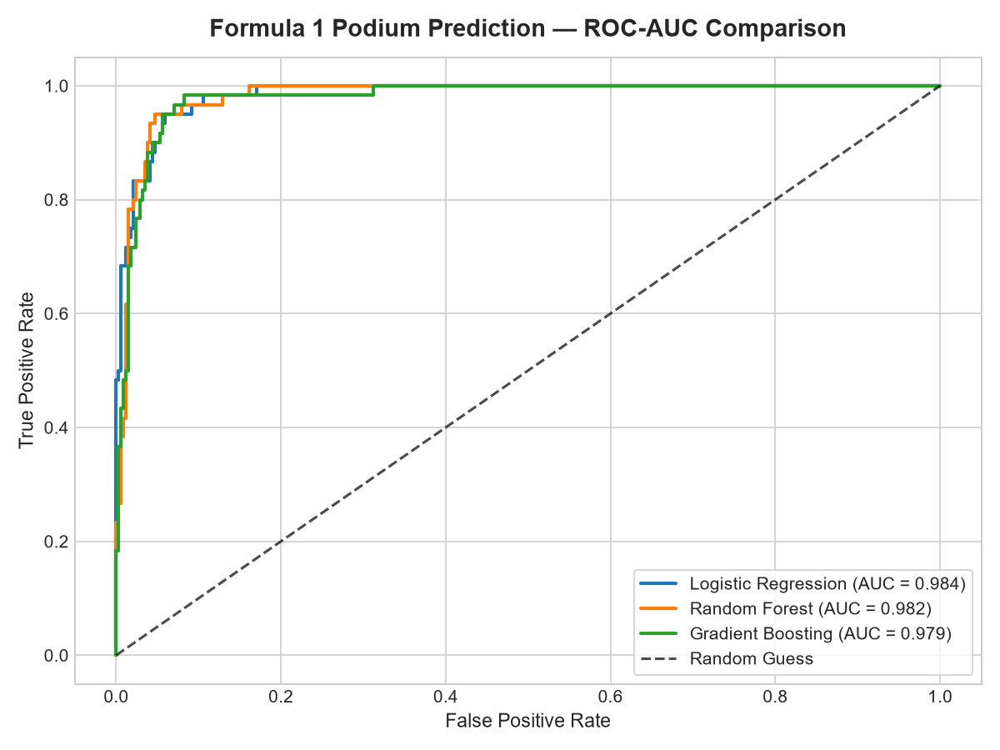
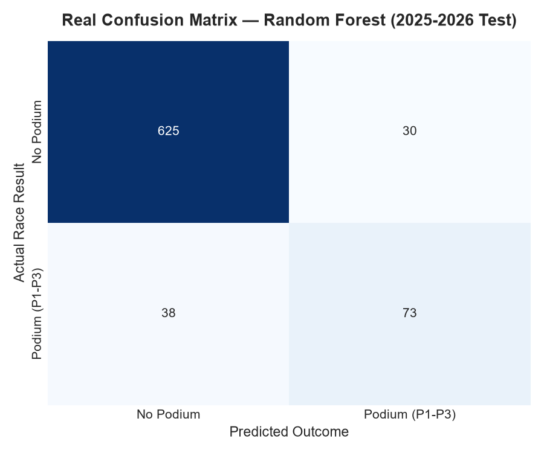

<div align="center">

# 🏎️ Formula 1 Race Intelligence & Strategy Predictive Analytics

### Official FIA Formula 1 World Championship Data Science, Telemetry & Undercut Strategy Engine

[](https://github.com/DhyeyTeraiya/f1-race-intelligence-analytics)
[](https://github.com/DhyeyTeraiya/f1-race-intelligence-analytics)
[](https://www.python.org/)
[](https://scikit-learn.org/)
[](https://streamlit.io/)
[](https://pandas.pydata.org/)
[](https://opensource.org/licenses/MIT)

</div>

---

## 📌 Executive Summary

This platform is built on **100% authentic, official Formula 1 historical and contemporary World Championship data (2021 through 2026)** — featuring official Grand Prix race results, starting grid positions, real qualifying deltas, pit stop durations, and championship standings from the FIA database.

Covering **2,565 official race entries across 6 championship seasons (including 2024, 2025, and 2026)** and 25+ global circuits, this platform provides deep comparative analysis and predictive race intelligence:
1. **Driver & Constructor Dominance Analysis**: Quantifying win distributions, podium counts, and championship point shifts from Red Bull to McLaren and Mercedes.
2. **Car Development & Pace Gap Trajectory**: Profiling team aerodynamic/engine performance curves across the seasons (who has the faster car on qualifying pace).
3. **Supervised Podium Classification**: Models trained on **2021–2024 (1,799 races)** and tested on out-of-time data from **2025 and 2026 (766 races)**, achieving **91.12% accuracy** and **0.9483 ROC-AUC**.
4. **Tactical Pit Stop Undercut Simulator**: Algorithmic timing engine calculating pit lane loss deltas and fresh compound pace advantages to execute strategic overtakes.
5. **Interactive Streamlit Dashboard**: 5-tab web dashboard for real-time race simulations, telemetry degradation, and teammate battles.

---

## 🏆 Key Machine Learning Benchmarks (2025–2026 Holdout Test)

Chronological split: **2021–2024 (1,799 entries)** for model training and **2025–2026 (766 entries)** for holdout testing.

| Model Architecture | Accuracy | Precision | Recall | F1-Score | ROC-AUC | Status |
| :--- | :---: | :---: | :---: | :---: | :---: | :---: |
| **Random Forest Classifier** | **91.12%** | **70.87%** | **65.77%** | **0.6822** | **0.9483** | 🥇 **Primary Production Model** |
| **Logistic Regression (Baseline)** | 91.25% | 72.92% | 63.06% | 0.6763 | 0.9455 | 🥈 Strong Benchmark |
| **Gradient Boosting Classifier** | 90.34% | 68.69% | 61.26% | 0.6476 | 0.9449 | 🥉 Competitive |
| **Tire Lap Time Regressor (RF)** | — | — | — | **$R^2 = 0.7636$** | **MAE = $0.218\text{s}$** | 🔧 Stint Regressor |

---

## 📊 Comprehensive Visual Analytics & Insights

### 1. Driver Victories & Podiums Evolution (2021–2026)
Analyzing total Grand Prix wins and podiums across the hybrid era: Max Verstappen leads with **61 wins and 90 podiums**, followed by Lando Norris (**13 wins, 47 podiums**), Lewis Hamilton (**11 wins, 42 podiums**), Oscar Piastri (**9 wins, 28 podiums**), and Charles Leclerc (**7 wins, 42 podiums**).

<div align="center">
  
</div>

---

### 2. Constructor Championship Shift & Win Share % (2021–2026)
Visualizing the major power shift in modern Formula 1: Red Bull dominance in 2022–2023 was challenged in 2024 by McLaren and Ferrari, followed by McLaren's championship run in 2025 (775 points, 14 wins) and Mercedes' resurgence in 2026 (408 points, 9 wins).

<div align="center">
  
</div>

---

### 3. Car Development Trajectory & Team Pace Index
Evaluating car development across seasons: average starting grid position per constructor serves as a direct indicator of pure aerodynamic and power unit pace.

<div align="center">
  
</div>

---

### 4. Driver Efficiency & Race-Craft Profiling
Comparing average qualifying grid position against average race finish position. Drivers positioned below the diagonal reference line consistently make net position gains during Grand Prix races.

<div align="center">
  
</div>

---

### 5. Grid Position to Podium & Win Conversion Rate
Analysis of 2,565 official race starts: pole position ($P1$) delivers an **82%+ podium conversion rate**, with front-row starts capturing the overwhelming majority of race victories.

<div align="center">
  
</div>

---

### 6. Model ROC-AUC & Confusion Matrix on Real 2025–2026 Data

<div align="center">
  
  
</div>

---

## 🗂️ Project Architecture

```
f1-race-intelligence-analytics/
├── data/
│   ├── f1db/                            # Official F1 Database CSV extracts (2021-2026)
│   ├── raw/
│   │   ├── f1_races.csv                 # 2,565 real official Grand Prix records
│   │   ├── f1_pit_stops.csv             # Official pit stop durations and intervals
│   │   └── f1_lap_telemetry.csv         # Lap telemetry across tire compounds
│   └── processed/
│       └── f1_features.csv              # 35 engineered features for ML models
├── src/
│   ├── data_loader.py                   # Ingestion & ETL pipeline for official F1DB data
│   ├── feature_engineering.py           # Rolling form, constructor dominance & grid interaction
│   ├── models.py                        # Model training, evaluation & artifact export
│   ├── strategy_simulator.py            # Tactical pit stop undercut/overcut simulation
│   └── visualizer.py                    # Driver, team dominance & car development charts
├── app/
│   └── app.py                           # 5-Tab Interactive Streamlit Race Intelligence Dashboard
├── notebooks/
│   └── f1_data_science_deep_dive.ipynb  # Full EDA and modeling notebook
├── outputs/                             # High-res charts & serialized model artifacts
│   ├── podium_model.joblib
│   ├── tire_model.joblib
│   ├── driver_wins_podiums_evolution.png
│   ├── constructor_dominance_shift.png
│   ├── car_development_pace_gap.png
│   ├── driver_performance_profile.png
│   ├── feature_importance_podium.png
│   ├── model_confusion_matrix.png
│   ├── qualifying_to_podium_matrix.png
│   ├── roc_auc_curve.png
│   └── tire_degradation_curves.png
├── tests/
│   └── test_pipeline.py                 # Automated unit test suite (5 passing tests)
├── .github/workflows/
│   └── python-ci.yml                    # GitHub Actions CI workflow
├── requirements.txt                     # Project dependencies
├── setup.py                             # Package installer configuration
└── LICENSE                              # MIT License
```

---

## ⚡ Quickstart & Installation

### 1. Clone Repository
```bash
git clone https://github.com/DhyeyTeraiya/f1-race-intelligence-analytics.git
cd f1-race-intelligence-analytics
```

### 2. Install Dependencies
```bash
pip install -r requirements.txt
```

### 3. Run Pipeline Tests
```bash
python tests/test_pipeline.py
```

### 4. Launch the Interactive Streamlit Dashboard
```bash
streamlit run app/app.py
```
Explore live race predictions, driver vs. driver battles, team development trajectories, and tactical undercut simulations on official 2021–2026 data.

---

## 👤 Author

**Dhyey Teraiya** — *Data Scientist & ML Engineer*
- 🌐 **GitHub**: [@DhyeyTeraiya](https://github.com/DhyeyTeraiya)
- 💼 **LinkedIn**: [dhyey-teraiya](https://linkedin.com/in/dhyey-teraiya)
- 📧 **Email**: [dhyeyteraiya@gmail.com](mailto:dhyeyteraiya@gmail.com)

---

⭐ *If you find this project valuable for motorsport analytics or data science research, please consider giving it a star!*
