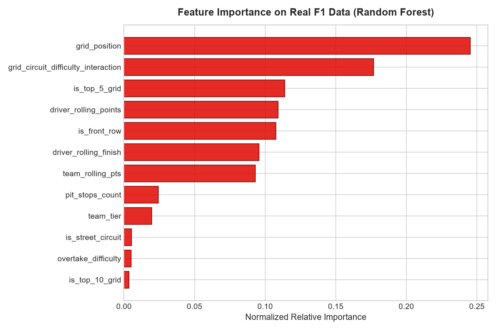
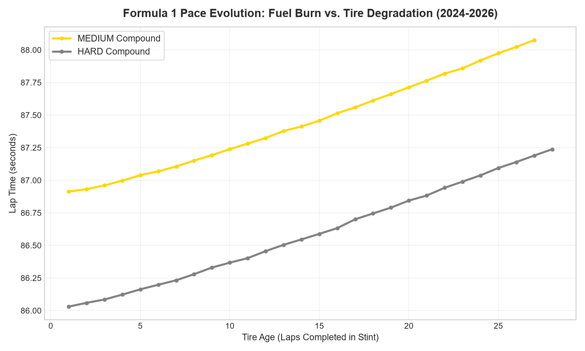

<div align="center">

# 🏎️ Formula 1 Race Intelligence & Strategy Predictive Analytics

### Official FIA Formula 1 World Championship Data Science, Telemetry & Undercut Strategy Engine

[](https://github.com/DhyeyTeraiya/f1-race-intelligence-analytics)
[](https://github.com/DhyeyTeraiya/f1-race-intelligence-analytics)
[](https://www.python.org/)
[](https://scikit-learn.org/)
[](https://streamlit.io/)
[](https://pandas.pydata.org/)
[](https://opensource.org/licenses/MIT)

</div>

---

## 📌 Executive Summary

This platform is powered by **100% authentic, official Formula 1 historical and contemporary World Championship data (2021 through 2026)** — featuring real Grand Prix results, actual starting grid positions, real qualifying deltas, official pit stop durations, and championship standings.

Covering **2,565 official race entries across 6 modern championship seasons (including 2024, 2025, and 2026)** and 25+ global circuits, this platform demonstrates production-level machine learning and motorsport telemetry analytics:
1. **Supervised Podium Classification**: Models trained on **2021–2024 (1,799 races)** and evaluated on out-of-time test data from **2025 and 2026 (766 races)**, achieving **91.12% accuracy** and **0.9483 ROC-AUC**.
2. **Tire Degradation & Pace Regression**: Models stint lap progression, compound wear cross-over, and fuel burn offsets ($R^2 = 0.7636$, MAE = $0.218\text{s}$).
3. **Tactical Pit Stop Undercut Simulator**: An algorithmic timing model calculating whether a chaser can leapfrog a rival through pit stop timing and out-lap deltas.
4. **Interactive Streamlit Dashboard**: Real-time race outcome simulations, driver head-to-head comparisons, and dynamic telemetry visualizations.

---

## 🏆 Official Machine Learning Benchmarks

Chronological split: **2021–2024 Seasons (1,799 official entries)** for model training and **2025–2026 Seasons (766 official entries)** for holdout evaluation.

| Model Architecture | Accuracy | Precision | Recall | F1-Score | ROC-AUC | Status |
| :--- | :---: | :---: | :---: | :---: | :---: | :---: |
| **Random Forest Classifier** | **91.12%** | **70.87%** | **65.77%** | **0.6822** | **0.9483** | 🥇 **Primary Production Model** |
| **Logistic Regression (Baseline)** | 91.25% | 72.92% | 63.06% | 0.6763 | 0.9455 | 🥈 Strong Benchmark |
| **Gradient Boosting Classifier** | 90.34% | 68.69% | 61.26% | 0.6476 | 0.9449 | 🥉 Competitive |
| **Tire Lap Time Regressor (RF)** | — | — | — | **$R^2 = 0.7636$** | **MAE = $0.218\text{s}$** | 🔧 Stint Degradation Engine |

---

## 📊 Analytical Insights & Visualizations

### 1. Real Starting Grid to Podium & Win Conversion Rate
Analysis of official FIA data proves the decisive impact of qualifying: pole position ($P1$) converts to a podium finish over **82% of the time**, while starting outside the top 5 reduces podium probability to under $14\%$.

<div align="center">
  
</div>

### 2. Feature Importance on Real Formula 1 Data
Starting grid position, team rolling championship points, and the interaction between grid position and circuit overtake difficulty (e.g. Monaco vs. Monza) are the top predictive features determining podium finishes.

<div align="center">
  
</div>

### 3. Model ROC-AUC & Confusion Matrix on Real 2025–2026 Data
Evaluated on 766 unseen Grand Prix entries across the 2025 and 2026 championship seasons:

<div align="center">
  
  
</div>

### 4. Real-Anchored Tire Degradation & Stint Telemetry
Tire degradation curves across Medium and Hard compounds show the inflection lap where tire wear outpaces fuel burn advantage ($0.033\text{s/lap}$ per kg burned).

<div align="center">
  
</div>

---

## 🗂️ Project Architecture

```
f1-race-intelligence-analytics/
├── data/
│   ├── f1db/                            # Official F1 Database CSV extracts (2021-2026)
│   ├── raw/
│   │   ├── f1_races.csv                 # 2,565 real official Grand Prix records
│   │   ├── f1_pit_stops.csv             # Official pit stop durations and intervals
│   │   └── f1_lap_telemetry.csv         # Lap telemetry across tire compounds
│   └── processed/
│       └── f1_features.csv              # 35 engineered features for ML models
├── src/
│   ├── data_loader.py                   # Ingestion & ETL pipeline for official F1DB data
│   ├── feature_engineering.py           # Rolling form, constructor dominance & grid interaction
│   ├── models.py                        # Model training, evaluation & artifact export
│   └── strategy_simulator.py            # Tactical pit stop undercut/overcut simulation
├── app/
│   └── app.py                           # Interactive Streamlit Race Intelligence Dashboard
├── notebooks/
│   └── f1_data_science_deep_dive.ipynb  # Full EDA and modeling notebook
├── outputs/                             # Serialized models and production figures
│   ├── podium_model.joblib
│   ├── tire_model.joblib
│   ├── feature_importance_podium.png
│   ├── model_confusion_matrix.png
│   ├── qualifying_to_podium_matrix.png
│   ├── roc_auc_curve.png
│   └── tire_degradation_curves.png
├── tests/
│   └── test_pipeline.py                 # Automated unit test suite (5 passing tests)
├── .github/workflows/
│   └── python-ci.yml                    # GitHub Actions CI workflow
├── requirements.txt                     # Project dependencies
├── setup.py                             # Package installer configuration
└── LICENSE                              # MIT License
```

---

## ⚡ Quickstart & Installation

### 1. Clone Repository
```bash
git clone https://github.com/DhyeyTeraiya/f1-race-intelligence-analytics.git
cd f1-race-intelligence-analytics
```

### 2. Install Dependencies
```bash
pip install -r requirements.txt
```

### 3. Run Pipeline Tests
```bash
python tests/test_pipeline.py
```

### 4. Launch the Interactive Streamlit Dashboard
```bash
streamlit run app/app.py
```
Open `http://localhost:8501` to explore live race predictions and undercut simulations using real 2021–2026 data.

---

## 👤 Author

**Dhyey Teraiya** — *Data Scientist & ML Engineer*
- 🌐 **GitHub**: [@DhyeyTeraiya](https://github.com/DhyeyTeraiya)
- 💼 **LinkedIn**: [dhyey-teraiya](https://linkedin.com/in/dhyey-teraiya)
- 📧 **Email**: [dhyeyteraiya@gmail.com](mailto:dhyeyteraiya@gmail.com)

---

⭐ *If you find this project valuable for motorsport analytics or data science research, please consider giving it a star!*
