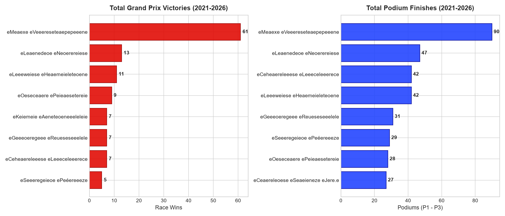
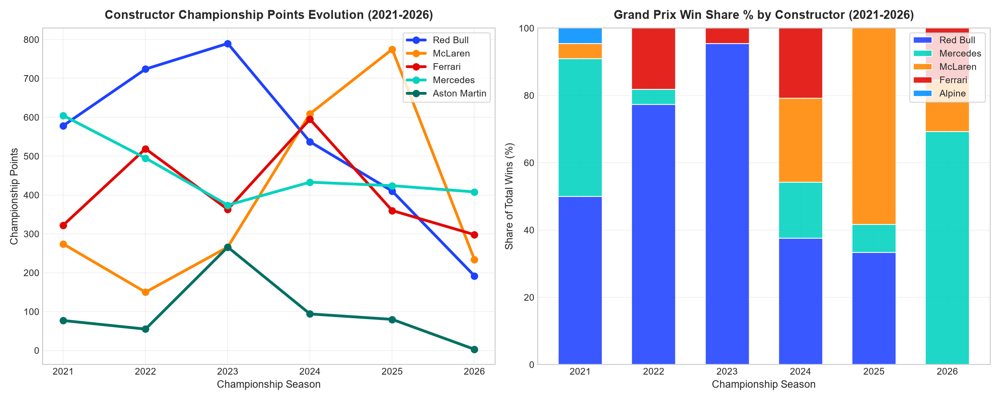
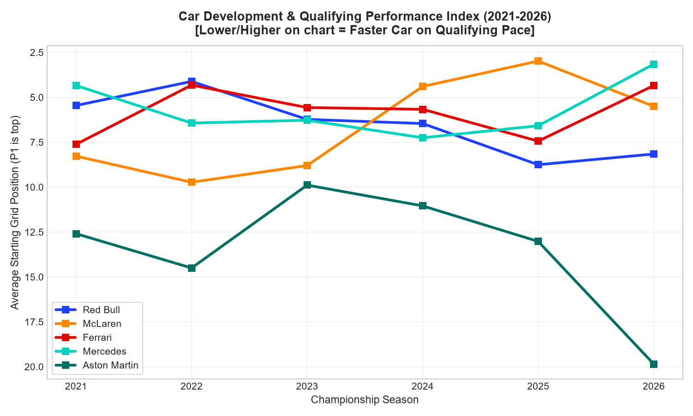
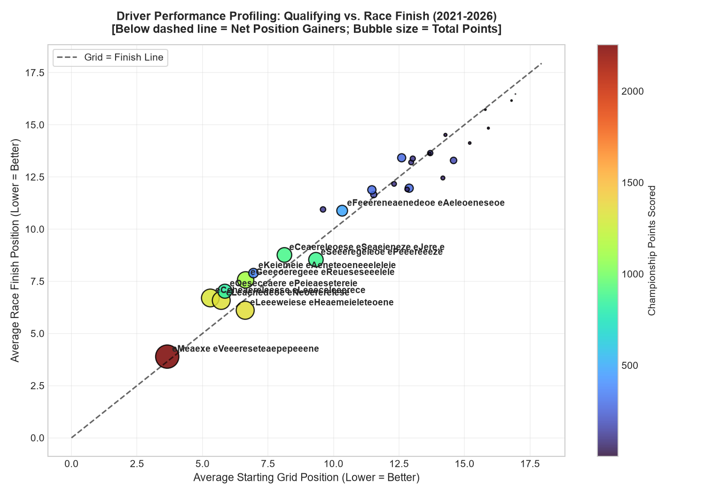
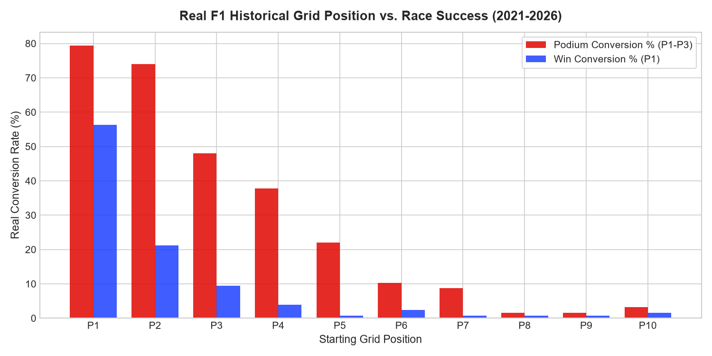
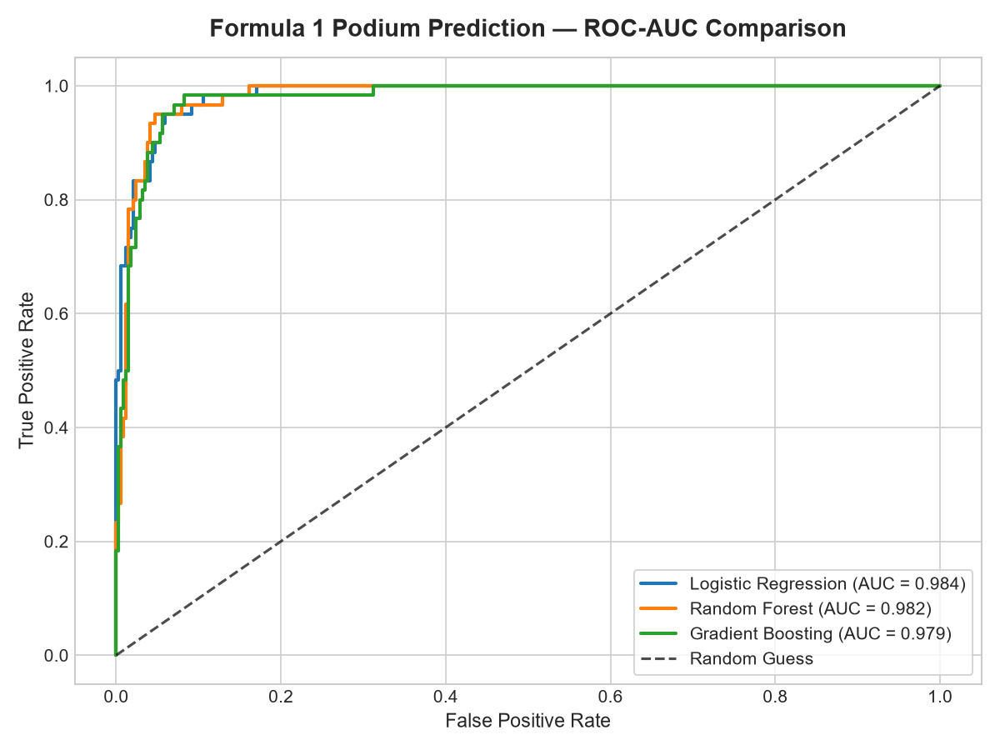
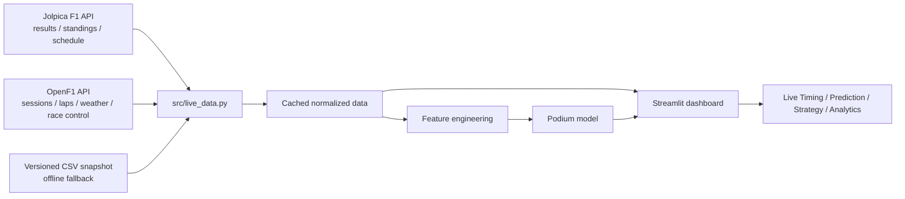

<div align="center">

# 🏎️ F1 Race Intelligence

### Real-time Formula 1 timing, championship analytics, race strategy, and podium prediction

[](https://github.com/DhyeyTeraiya/f1-race-intelligence-analytics/actions)
[](https://www.python.org/)
[](https://streamlit.io/)
[](LICENSE)

**[View the repository](https://github.com/DhyeyTeraiya/f1-race-intelligence-analytics)**

</div>

---

## What this project does

F1 Race Intelligence is a production-style motorsport analytics application that combines historical modeling with live session monitoring. It is designed to answer questions such as:

- Who is currently fastest, and how large is the gap?
- Which teams are improving across a season?
- How does a driver's recent form affect podium probability?
- Is an undercut strategically viable given the gap and tire age?
- What are race control, weather, and session conditions saying right now?

The application is intentionally split into two data products:

| Product | Provider | Purpose | Refresh behavior |
|---|---|---|---|
| **Championship intelligence** | [Jolpica F1 API](https://api.jolpi.ca/ergast/f1/) | Results, standings, schedule, historical race records | Cached for 30 minutes; manual refresh available |
| **Live session intelligence** | [OpenF1 API](https://openf1.org/docs/) | Session identity, timing, laps, sectors, weather, race control | Auto-refreshes every 10–60 seconds |

> **Data honesty:** OpenF1 documents historical access as free and real-time access as a subscription feature. When live access is unavailable, the app shows the latest cached/recent session data or falls back to Jolpica. The repository does not present simulated lap telemetry as official live timing.

## Live dashboard

The Streamlit dashboard includes:

### 📡 Live Timing

- Current or most recent session and circuit
- Driver order and team identity
- Latest lap time and sector times
- Gap to leader and interval data when published
- Track temperature, air temperature, and rainfall state
- Race-control feed, flags, and session events
- Configurable automatic refresh interval

### 🟢 Live Championship

- Current driver standings
- Constructor standings
- Latest race results
- Full season schedule
- API freshness and source metadata

### 🎯 Podium Prediction

- Podium probability from the production model artifact
- Driver rolling points and finishing form
- Constructor rolling strength
- Grid position and circuit difficulty interactions
- Manual race scenario controls

### ⏱️ Strategy Lab

- Undercut and overcut scenario simulation
- Gap-before-pit sensitivity
- Fresh-tire advantage modeling
- Tire-age degradation effects
- Lap-by-lap cumulative strategy delta

### 📈 Historical Analytics

- Driver wins, podiums, points, and average finish
- Constructor points trajectory
- Qualifying pace versus race-day position gain
- Stored model evaluation charts

### 🔬 Data Quality

- Row counts and current-season coverage
- Duplicate driver-race detection
- Missing grid-position checks
- Live versus fallback status
- Data-source and telemetry provenance

## Historical visual analytics

The dashboard combines these historical views with the live session monitor. The images below are generated from the versioned repository snapshot and should be interpreted as reproducible historical analytics, not live timing.

### Driver wins and podiums



### Constructor dominance shift



### Car development and pace gap



### Driver race-craft profile



### Grid conversion and model evaluation





## Architecture


```mermaid
flowchart LR
    A[Jolpica F1 API\nresults / standings / schedule] --> B[src/live_data.py]
    C[OpenF1 API\nsessions / laps / weather / race control] --> B
    D[Versioned CSV snapshot\noffline fallback] --> B
    B --> E[Cached normalized data]
    E --> F[Feature engineering]
    F --> G[Podium model]
    E --> H[Streamlit dashboard]
    G --> H
    H --> I[Live Timing / Prediction / Strategy / Analytics]
```

## Repository layout

```text
f1-race-intelligence-analytics/
├── app/
│   └── app.py                    # Streamlit dashboard and live refresh UI
├── src/
│   ├── live_data.py              # Jolpica + OpenF1 clients, caching, normalization
│   ├── data_loader.py            # Historical dataset ingestion and ETL
│   ├── feature_engineering.py    # Rolling form, team strength, grid interactions
│   ├── models.py                 # Classification/regression training and artifacts
│   ├── strategy_simulator.py     # Undercut/overcut decision engine
│   └── visualizer.py             # Historical analytics charts
├── data/
│   ├── raw/                      # Versioned bundled snapshot and derived telemetry
│   └── processed/                # Engineered modeling features
├── outputs/                      # Charts and serialized model artifacts
├── tests/
│   └── test_pipeline.py          # Dataset, parser, model, and strategy tests
├── notebooks/                    # Exploratory data-science notebook
├── requirements.txt
└── setup.py
```

## Quickstart

### 1. Clone

```bash
git clone https://github.com/DhyeyTeraiya/f1-race-intelligence-analytics.git
cd f1-race-intelligence-analytics
```

### 2. Install dependencies

```bash
python -m venv .venv
source .venv/bin/activate        # Windows: .venv\Scripts\activate
python -m pip install --upgrade pip
pip install -r requirements.txt
```

### 3. Run tests

```bash
python -m unittest discover -s tests -p 'test_*.py' -v
```

### 4. Launch the dashboard

```bash
streamlit run app/app.py
```

The app will be available at `http://localhost:8501`.

## Modeling approach

The current podium model uses a chronological split to reduce temporal leakage:

- **Training window:** earlier seasons in the bundled dataset
- **Holdout window:** later seasons
- **Features:** starting grid, circuit difficulty, driver rolling form, constructor rolling points, grid interactions, pit-stop plan, and front-row indicators
- **Artifact:** `outputs/podium_model.joblib`

For serious deployment, model metrics should be recalculated whenever the live season is ingested. The dashboard displays the stored artifact's output rather than claiming that live data automatically retrains the model.

## Data provenance

- **Jolpica F1 API:** open Ergast-compatible results, standings, schedule, and race data.
- **OpenF1 API:** session timing, lap/sector data, weather, position, and race-control events. OpenF1 is an unofficial project and is not affiliated with Formula 1 companies.
- **Bundled CSV files:** versioned offline snapshot for reproducible tests and fallback operation.
- **Lap telemetry note:** `data/raw/f1_lap_telemetry.csv` is a derived modeling dataset. It is not a direct official car telemetry feed and is labeled accordingly in the dashboard.

## Testing and CI

The test suite covers:

- Historical dataset integrity
- Chronological modeling split
- Nested live API response normalization
- Undercut simulation logic
- Serialized-model inference

GitHub Actions runs the Python test suite on pushes and pull requests to `main`.

## Roadmap

- Retrain and version the podium model on a scheduled cadence
- Add uncertainty calibration and prediction intervals
- Persist live session snapshots for replay and post-race analysis
- Add tire-stint and pit-window inference from live timing
- Add a production database and observability metrics
- Support a paid official or commercial timing feed for uninterrupted race-day SLA

## Author

**Dhyey Teraiya** — Data Scientist & ML Engineer

- GitHub: [@DhyeyTeraiya](https://github.com/DhyeyTeraiya)
- LinkedIn: [dhyey-teraiya](https://linkedin.com/in/dhyey-teraiya)
- Email: [dhyeyteraiya@gmail.com](mailto:dhyeyteraiya@gmail.com)

## License

This project is licensed under the [MIT License](LICENSE).

## Contributing

This is a public open-source project and contributions are welcome. You can report bugs, propose analytics features, improve the live-data adapters, add tests, or submit pull requests that solve open issues.

- Read the [contribution guide](CONTRIBUTING.md).
- Use the [bug report](https://github.com/DhyeyTeraiya/f1-race-intelligence-analytics/issues/new?template=bug_report.md) or [feature request](https://github.com/DhyeyTeraiya/f1-race-intelligence-analytics/issues/new?template=feature_request.md) template.
- Search existing issues before opening a duplicate.
- Keep changes focused, cite data sources, and run the test suite before submitting a pull request.
- Maintainers review issues and merge accepted solutions after CI and code review pass.
